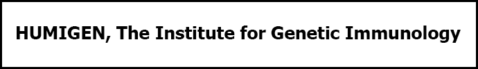

  
`humigen.org`  

# Dates:  
2005 - 2008  
# Technologies:  
HTML4, CSS2, Flash
# Description:  
This website was meant to give information about this newly formed research and development laboratory.  It shows the personnel and their publications as well as the type of research they are conducting which hopefully attracts other personnel to join their work.  

I oversaw the full development cycle of this project from design, coding, to maintenance.  
# Screenshots:
  

  

  

  
